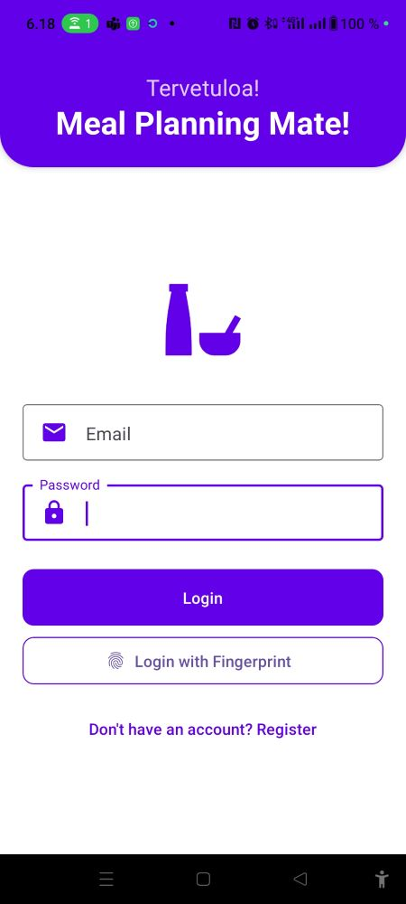
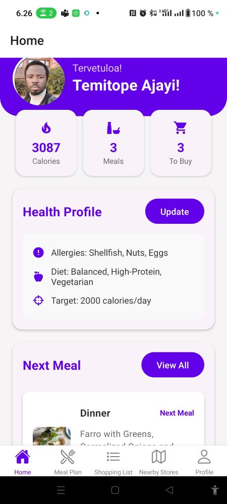
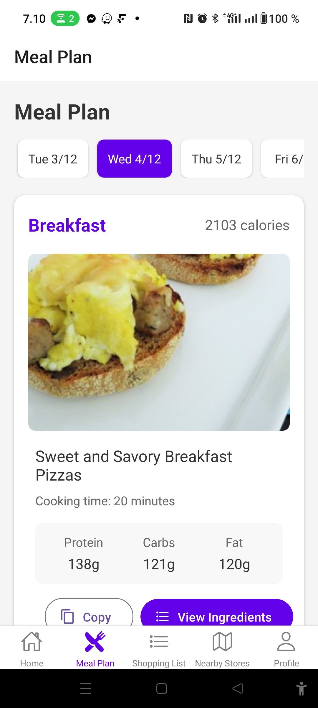
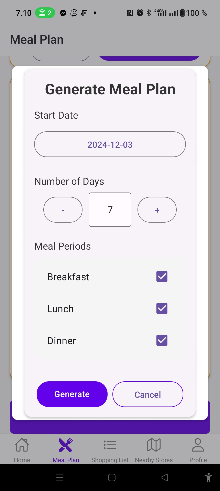
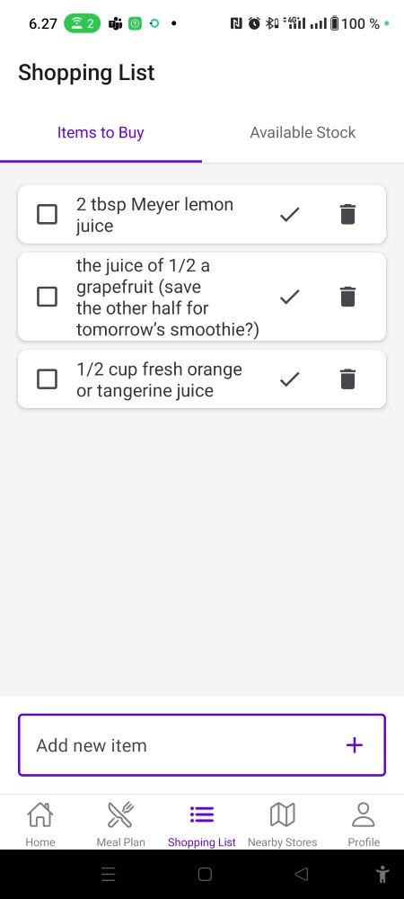
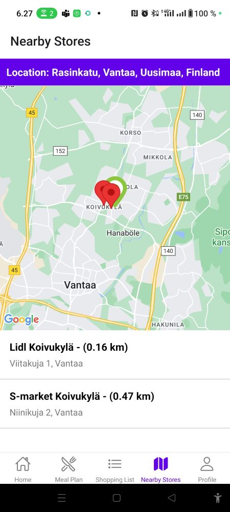
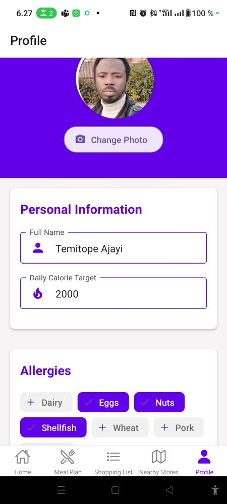
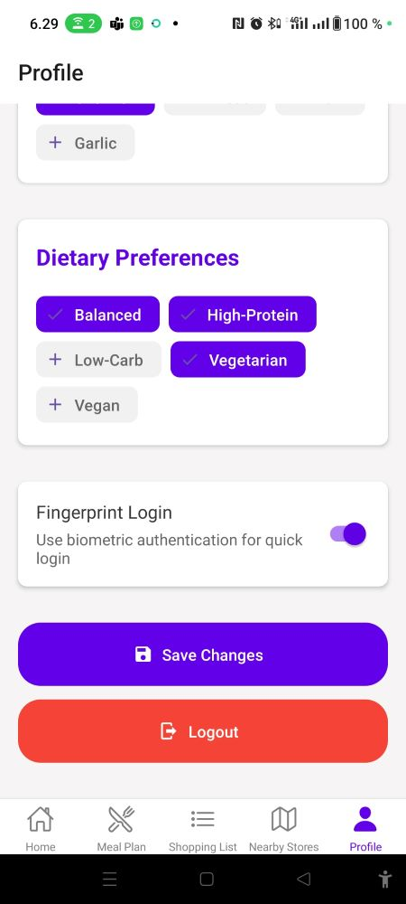

# 🍽️ Meal Planning Mate

A React Native mobile application streamlining meal planning, recipe discovery, and grocery shopping management. Simplify your weekly meal prep with automated planning and integrated shopping lists.


## ✨ Core Features

- **Smart Meal Planning**

  - Auto-generate weekly meal plans
  - Copy/paste meals between dates
  - Customizable meal preferences

- **Recipe Management**

  - Access diverse recipe database
  - View nutritional information
  - Save favorite recipes

- **Shopping & Inventory**
  - Auto-sync shopping lists
  - Real-time stock tracking
  - Store locator integration

## 🛠️ Tech Stack

- Frontend: React Native, Expo
- UI Framework: React Native Paper
- Backend: Firebase
- APIs: Google Places, Edamam Recipe

## 📱 Screenshots

<div align="center">
  <div style="display: flex; flex-wrap: wrap; gap: 1%; justify-content: center;">
    
    
    
    
    
    
    
    
  </div>
</div>

## 🚀 Quick Start

1. **Clone & Install**

```bash
git clone https://github.com/Topebhh500/MealPlanningApp.git
cd MealPlanningApp
npm install
```

2. **Configure Environment**

```bash
cp .env.example .env
# Add API keys to .env file
```

3. **Run Application**

```bash
npm start
# or
expo start
```

## 🔑 Environment Variables

```env
# Firebase Configuration
FIREBASE_API_KEY=your_firebase_api_key
FIREBASE_AUTH_DOMAIN=your_firebase_auth_domain
FIREBASE_PROJECT_ID=your_firebase_project_id
FIREBASE_STORAGE_BUCKET=your_firebase_storage_bucket
FIREBASE_MESSAGING_SENDER_ID=your_firebase_messaging_sender_id
FIREBASE_APP_ID=your_firebase_app_id
FIREBASE_MEASUREMENT_ID=your_firebase_measurement_id

# Google Places API
GOOGLE_PLACES_API_KEY=your_google_place_api_key

# Edamam Recipe API
EDAMAM_APP_ID=your_firebase_app_id
EDAMAM_API_KEY=your_edamam_api_key
```

## 📜 License

This project is licensed under the MIT License - see the [LICENSE](LICENSE) file for details.

## 👤 Author

**Ajayi Temitope**

- GitHub: [@Topebhh500](https://github.com/Topebhh500)
- LinkedIn: [Ajayi Temitope](https://www.linkedin.com/in/ajayi-temitope-72927733/)

## 🙏 Acknowledgments

- [Edamam](https://www.edamam.com/) for their comprehensive recipe API
- [Firebase](https://firebase.google.com/) for backend services
- [Expo](https://expo.dev/) for the development framework
- [React Native Paper](https://callstack.github.io/react-native-paper/) for UI components

---

Built with ❤️ by [Topebhh500](https://github.com/Topebhh500)
